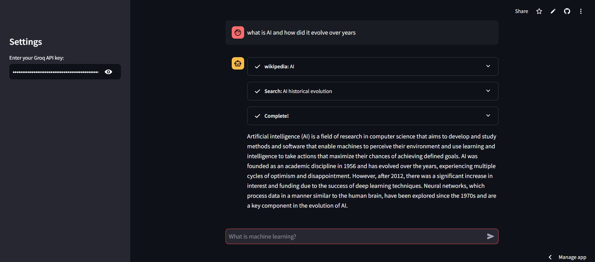

# 🌐 SmartSearch Hub: AI-Powered Knowledge Assistant

## 🚀 Overview
A sophisticated **AI-powered knowledge retrieval system** built as a Streamlit web application that revolutionizes information discovery and learning. By leveraging the power of LangChain tools and GROQ's advanced LLM, it acts as your personal research assistant, capable of:

- 📚 **Academic Research**: Access and summarize the latest scientific papers from ArXiv, perfect for researchers and students
- 📖 **Knowledge Mining**: Extract relevant information from Wikipedia articles with smart summarization
- 🔍 **Web Intelligence**: Conduct comprehensive web searches through DuckDuckGo for up-to-date information
- 🤖 **Smart Processing**: Utilize GROQ LLM to understand context, combine information from multiple sources, and provide coherent, relevant answers
- 💡 **Interactive Learning**: Engage in natural conversations about complex topics with an AI that adapts to your queries

Perfect for researchers, students, professionals, and anyone seeking to efficiently gather and understand information from diverse sources in a conversational format.

## ✨ Key Features


- 💬 Natural Language Chat Interface
- 🔄 Multi-Source Integration
- 🛠️ Advanced LLM Processing (GROQ)
- 📝 Conversation History
- 🔒 Secure API Key Management

## 🛠️ Tech Stack

- 🤖 LangChain
- 🌊 Streamlit
- 🧠 GROQ LLM
- 🔍 Search APIs (ArXiv, Wikipedia, DuckDuckGo)

## 📋 Quick Start

1. **Clone Repository**
```bash
git clone https://github.com/Yuvraj0014/Smart-Search-Hub.git
cd Smart-Search-Hub
```

2. **Setup Environment**
```cmd
python -m venv venv
source venv/bin/activate  # Linux/MacOS
venv\Scripts\activate     # Windows
```

3. **Install Dependencies**
```cmd
pip install -r requirements.txt
```

4. **Configure API Keys**
```env
GROQ_API_KEY=<your-key>
```

5. **Launch App**
```cmd
streamlit run app.py
```

## 🌐 Live Demo
Try it now: [SmartSearch Hub App](https://smart-search-app.streamlit.app/)

## 📂 Project Structure
```
📂 Root
├── app.py              # Main application
├── .env               # API keys
├── requirements.txt   # Dependencies
└── README.md         # Documentation
```

## 🔄 How It Works

### 1. **User Interaction** 🗣️
- Input natural language queries through an intuitive chat interface
- System maintains context throughout the conversation

### 2. **Query Processing** 🧠
- GROQ LLM analyzes the user's intent
- Determines the most relevant sources to query
- Formulates appropriate search strategies

### 3. **Multi-Source Search** 🔍
- ArXiv: Retrieves and summarizes academic papers
- Wikipedia: Extracts relevant article content
- DuckDuckGo: Searches the web for current information

### 4. **Response Generation** ✨
- Combines information from multiple sources
- Ensures coherent and comprehensive answers
- Presents information in a conversational format

## 🔧 Configuration Options

### API Keys
- GROQ API key for LLM functionality
- Securely stored in .env file
- Easily configurable through Streamlit sidebar

### Search Parameters
- Customizable search depth
- Adjustable response length
- Source priority settings

## Output Screen



## 📜 License
GNU General Public License v3

## 🤝 Acknowledgments

- LangChain Framework
- Streamlit Platform
- GROQ API
- Search Partners (ArXiv, Wikipedia, DuckDuckGo)

## 🐛 Known Issues & Future Improvements

### Current Limitations
- Rate limits on API calls
- Response time varies with query complexity
- Source availability affects results

### Planned Features
- Additional search sources
- Enhanced result filtering
- Advanced conversation memory
- Custom source prioritization

## 📧 Contact
Questions or ideas? Reach out! [Your contact info]

## 🤝 Contributing
Contributions are welcome! Please feel free to submit a Pull Request.

### Guidelines
1. Fork the repository
2. Create your feature branch
3. Commit your changes
4. Push to the branch
5. Create a new Pull Request
